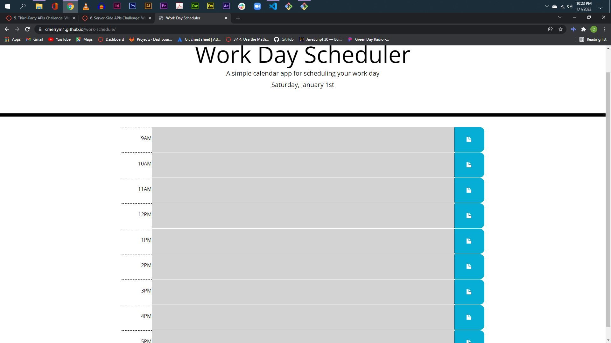

#Desciption
This is a work day scheduler that allows you to add tasks for each hour from 9am to 5 pm. If the time block is in the past (before the current hour) the description block turns gray. If the time block is in the present, it turns red. And if the time block is the future, it shows green. The Day and Date display at the top of the app. Users can enter events in the time blocks and the events are saved to local storage. The events should persist, but they do not.

##Screenshot

###Deployed App Link
https://cmerrym1.github.io/work-schedule/